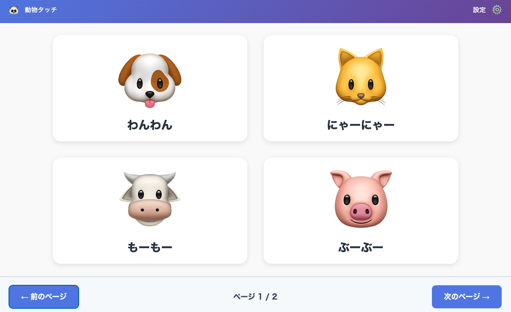

# 🐶 動物タッチ&サウンド

幼児用に作成した、タッチで動物の鳴き声が聞こえるインタラクティブWebアプリです。

## 📱 アプリ概要

画面に表示された動物をタップすると鳴き声が再生され、楽しいアニメーションが発生します。
iPad等での使用に最適化されており、オフラインでも動作します。

### 🎯 主な機能

- 8種類の動物（犬、猫、牛、豚、羊、鶏、アヒル、馬）
- タップで音声再生
- 穏やかなアニメーション効果
- 2ページ構成（各ページ4頭）
- ページ切替機能（ループ対応）
- 設定画面（音量調整、名前表示ON/OFF）
- オフライン対応（WiFiなしでも動作）
- 誤操作防止機能

## メイン画面



## 🚀 デモ

**公開URL**: [https://qubee38.github.io/animal-touch-app/](https://qubee38.github.io/animal-touch-app/)

## 📱 使い方

### 基本操作

1. **動物をタップ** → 鳴き声が再生され、アニメーションが発生
2. **「次のページ」ボタン** → 次の4頭を表示
3. **「前のページ」ボタン** → 前の4頭を表示

### 設定画面を開く

- 右上の「設定 ⚙️」を**1秒間長押し**

### オフライン使用

1. 初回アクセス時に全ファイルが自動でキャッシュされます
2. 以降、インターネット接続なしで使用できます

## 🛠️ 技術スタック

- **フロントエンド**: HTML5, CSS3, Vanilla JavaScript
- **音声**: HTML5 Audio API
- **オフライン対応**: Service Worker, Cache API
- **ホスティング**: GitHub Pages
- **対応デバイス**: iPad mini (8.3インチ), iOS Safari 14+

## 📋 ファイル構成

```
animal-touch-app/
├── index.html          # メインHTML
├── style.css           # スタイルシート
├── app.js              # メインロジック
├── animals.js          # 動物データ定義
├── sw.js               # Service Worker
├── README.md           # このファイル
└── assets/
    └── sounds/
        ├── dog.mp3
        ├── cat.mp3
        ├── cow.mp3
        ├── pig.mp3
        ├── sheep.mp3
        ├── chicken.mp3
        ├── duck.mp3
        └── horse.mp3
```

## 💻 ローカルでの実行方法

### 方法1: Live Server（推奨）

1. VSCodeで `index.html` を開く
2. 右クリック → 「Open with Live Server」

### 方法2: Pythonの簡易サーバー

```bash
cd animal-touch-app
python3 -m http.server 8000
```

その後、ブラウザで `http://localhost:8000/` を開く

## 🌐 GitHub Pagesへのデプロイ

```bash
# リポジトリを作成してプッシュ
git init
git add .
git commit -m "Initial commit"
git remote add origin https://github.com/[ユーザー名]/animal-touch-app.git
git branch -M main
git push -u origin main

# GitHub Pagesを有効化
# リポジトリの Settings → Pages → Source: main → Save
```

## 🎨 デザインの特徴

### 幼児向けの配慮

- **大きなタッチターゲット**: 各動物カードは約400px × 400px
- **十分な余白**: カード間60pxで誤タップを防止
- **明るい色使い**: 高彩度・高コントラスト
- **穏やかなアニメーション**: 拡大縮小のみ（点滅なし）

### 誤操作防止

- **連続タップ防止**: 音声再生中は該当動物のタップを無効化
- **設定画面への誤進入防止**: 1秒の長押しでのみ開く
- **スワイプ無効化**: ブラウザの戻る/進むを防止

## 🔧 カスタマイズ

### 動物を追加する場合

1. `animals.js` に動物データを追加
2. 音声ファイルを `assets/sounds/` に配置
3. `sw.js` のキャッシュリストに追加

```javascript
// animals.js に追加
{
    id: 'lion',
    name: 'がおー',
    emoji: '🦁',
    sound: 'ガオー',
    page: 3  // 新しいページ
}
```

### 見た目をカスタマイズ

`style.css` を編集して、色やサイズを変更できます。

## 👨‍👩‍👧 対象ユーザー

- **メインターゲット**: 9ヶ月〜2歳の乳幼児
- **操作者**: 子供自身（親の見守り推奨）
- **利用シーン**: 自宅、外出先（オフライン対応）

## 🙏 謝辞

娘の成長に合わせて、楽しく学びながら開発できました。